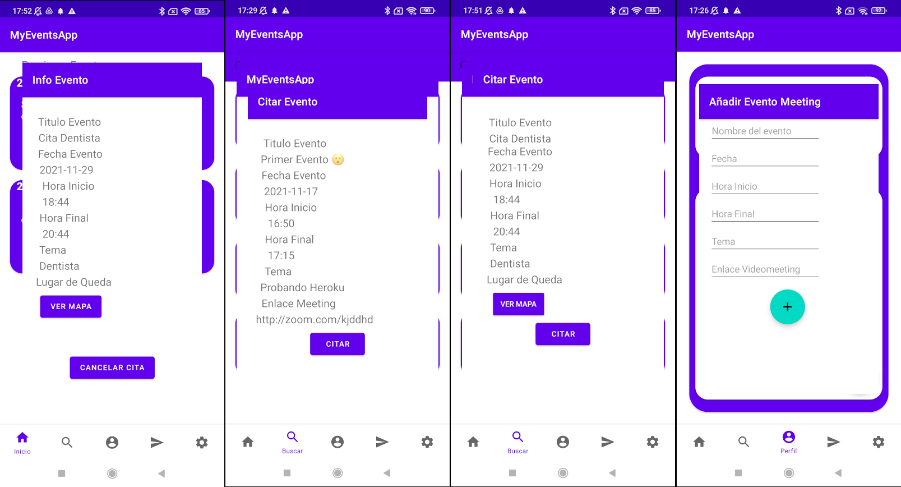

#### CICLO FORMATIVO DE GRADO SUPERIOR

### DESARROLLO DE APLICACIONES MULTIPLATAFORMA

##### ACCESO A DATOS - 2º CURSO

# AppEventos

###### Curso: 2021/22

###### AUTOR: Mario Parrilla Maroto

------

# Introducción

## Motivación y objetivos

He decidido realizar una aplicacion de eventos para dar solucion a las personas que quieres quedar o pedir cita para un evento o situacion, como por ejemplo realizar una reunión, quedar alguien para contratarle...

## Descripción de la aplicación

Esta aplicacion, permitirá al usuario solicitar eventos a otros usuarios, ademas de aceptar eventos que le pidan otros usuarios. Los eventos podran ser presencialmente dando la ubicación del lugar de quedada/evento, o remotamente atraves de un enlace de una plataforma de videoconferencia como zoom, google meets,... Además, los eventos tendras una duración determinada. El usuario al cual le estan citando, podrá cancelar eventos.

# Especificación de requisitos

## Requisitos funcionales

RQ1 - Control de Acceso: Se controlará mediante una ventana con un formulario de login donde los usuarios iniciarán sesión. (Para tener cuenta de usuario en la app, se tendrá que dar de alta desde el CMS). Además desde la ventana de ajustes, se podrá cerrar la sesion del usuario actual.

RQ2 - Gestión de Eventos: En las diferentes ventanas encontraremos las diferentes funcionalidades donde podremos hacer los eventos de CRUD, ademas de ver mapas segun el evento. Además, en esta app al trabajar con los eventos se modificará la base de datos local creada previamente por la app con los datos recibidos del CMS en la sincronización.

RQ2.1 - Ventana de Ajustes: En esta ventana, encontraremos diferentes funcionalidades como acerca de, soporte y cerrar sesion del usuario actual.

RQ2.2 - Ventana de Inicio: En esta ventana, encontraremos las cardview de los eventos del dia actual con datos de importacia, donde el usuario a citados a otros usuarios. Si pinchamos sobre la tarjeta de un evento de esta ventana, se nos abrirá un pop up (una nueva ventana), donde podremos ver los detalles al completo del evento.

RQ2.3 - Ventana de Busqueda: En esta ventana, encontraremos una barra de busqueda donde podremos filtrar las cardviews por los nombres de los usuarios de la app. Además, veremos las cardview de los usuarios con su username y su descripción. Cuando hagamos click sobre una cardview, se abrirá un pop up (una nueva ventana), donde podremos ver el perfil del usuario con su información y todos sus eventos creados. Si pinchamos sobre un evento del perfil de este usuario, se nos motrará un pop up (una nueva ventana), con la información detallada de ese evento con la opción de citar este evento.

RQ2.4 - Ventana de Perfil: En esta ventana, encontraremos la informacion de nuestro usuario, ademas de las cardviews de nuestros eventos ya creados con la información más impotante. Si pinchamos sobre estos eventos, podremos ver su información más detallada, ademas de poder modificar su información y poder eliminar el evento. También, podremos crear nuevos eventos atraves de un fab el cual contendrá otros dos fab, donde podremos o crear un evento presencial, donde se podrá crear el evento con su información precisa o el crear un evento meeting, donde se podrá crear el evento con su información precisa. Por último, si pinchamos en el telefono de usuario podremos llamarlo o mandar un sms.

RQ3 - Chat: Chat será bluetooth con el cual se podrá hablar con otros usuarios. A este requirimiento se podrá acceder desde una ventana de chat.

RQ4 - Sincronización: El CMS le enviará peticiones a la app para que sincronice los datos de la base de datos local de la app con la base de datos del CMS.

## Requisitos no funcionales

Seguridad: El usuario necesitará un usuario con su información para poder accerder a la aplicación.

Conectividad: El dispositivo movil, necesitará de conexión wifi, bluetooth y gps.

Tipos de dispositivos: Smartphones y tablets android en principio con versiones de android apartir de 5.0 .

Memoria: Los dispositivos necesitarán minimo 512MB de memoria RAM, aunque se recominenda 2Gb.

Procesador: Minimo se necesitará un procesador con Quad Core a 1.2GHz.

Almacenamiento: se necesitará minimo de un 1Gb de almacenamiento.

Version de Android: El dispositivo necesitará una versión minima de android 8.0 Oreo

## Wireframe

LOGIN:
El usuario entrará con su usuario en la aplicación pudiendo guarda la sesión. Ádemas, podrá recordar la contraseña si no la recuerda.

REGISTRO:
El usuario se podrá registrar en la aplicación y crear su propio usuario.

RECORDAR CONTRASEÑA:
Aquí el usuario podrá recordar su contraseña recibiendo un correo a su email con un codigo concreto.

NUEVA CONTRASEÑA: 
Aquí el usuario podrá crear una nueva contraseña para su cuenta.

INICIO:
Este es el menu inicial donde podrá encontrar los eventos que tiene ese dia, de lo contrario, podrá ir a buscar eventos.

BUSQUEDA:
Aquí el usuario buscará a los usuarios a los cuales desea citar un evento.

NOTIFICACIONES:
Aqui se mostrarán las notificaciones de la aplicación.

PERFIL PERSONAL:
Aquí el usuario verá sus eventos puediendo modificarlos a su elección.

PERFIL AJENO:
Aquí el usuario podrá elegir el dia y la hora disponible para citar un evento a otro usuario.

AJUSTES:
Aquí encontrará la selección del idioma de la aplicación, ademas de otros datos de interés.

EVENTO:
Aquí el usuario citador podrá ver la información de un evento puediendo cancelar su cita.

CITAR EVENTO:
El usuario podrá seleccionar los datos de la cita.

MODIFICAR EVENTO:
El usuario podrá editar sus eventos e incluso cancelarlos.

# Análisis Funcional

## Interfaz gráfico

App:

## Diagrama de clases

Clase Evento: En esta clase se usará para trabajar con los eventos de la aplicación.

Clase Usuario: En esta clase se usará para trabajar con los usuarios de la aplicación.

Clase Chat: Esta clase se usa para trabajar con la información de los chats en la aplicación.

Clase MensajeChat: Esta clase se utiliza para trabajar con la información de cada mensaje de los diferentes chats de la aplicación.

Clase SettingsFragment: Esta clase trabaja con la vista de ajustes de la aplicación.

Clase MainActivity: Esta clase es la clase donde se maneja los fragmentos en la primera carga de la aplicación.

Clase MyEventAppActivity: Esta es la clase principal de la aplicación donde se manejarán la primeras cargas de datos desde el servidor cms y se realizarán varias comprobaciones como comprobar si hay un usuario logueado actualmente.

Clase LoginActivity: Esta clase se encarga de realizar las comprobaciones relacionadas con el logueo en la aplicación de los usuarios.

Clase LoginModel: Esta clase se encarga de recuperar datos para pasarselos al LoginActivity para que pueda realizar sus operaciones correctamente.

Clase Homefragment: Esta clase se encarga de cargar los eventos los cuales el usuario logeado tiene citados.

Clase Homemodel: Esta clase se encarga de recuperar los datos para homefragment para que trabaje correctamente.

Clase Adaptadorproximoevento: Esta clase se encarga de cargar el layaout y los datos de los eventos en la vista.

Clase Buscarfragment: Esta clase se encarga de buscar los usuarios de la plataforma para poder ver sus perfiles para citar sus eventos.

Clase Buscarmodel: Esta clase proporciona los datos a buscarfragment.

Clase Adaptadorbusqueda: Esta clase se encarga de cargar el layaout y los datos lo de los usuarios en la vista.

Clase ExternalProfileActivity: Esta clase se encarga de mostrar los datos y eventos disponibles del perfil del usuario buscado en el fragmento de buscar .

Clase ExternalProfileModel: Esta clase se encarga de pasar los datos del usuario buscado a la clase ExternalProfileActivity para su correcta funcionalidad.

Clase AdaptadorEventoExternalProfile: Esta clase se encarga de cargar el layaout y los datos del usuario y de sus eventos disponibles.

Clase Perfilfragment: Esta clase se encarga de cargar el perfil del usuario el cual esta logeado en la aplicacion y poder llamar a los popups para agregar, modificar y eliminar sus propios eventos.

Clase Perfilmodel: Esta clase proporciona los datos del usuario logeado al perfilfragment.

Clase Adaptadorevento: Esta clase se encarga de cargar el layaout y los datos del usuario logueado y sus eventos.

Clases PopupCrearEventoPresencial y PopupCrearEventoMeeting: Estas clases se encargan de crear un evento propio, verificando que los datos estén correctamente puestos.

Clases PopupModificiarEventoPresencial y PopupModificiarEventoMeeting: Estas clases se encargan de modificiar un evento propio, verificando que los datos estén correctamente puestos y si este evento ya esta citado, no se permitirá modificarlo, además de poder eliminar estos eventos.

Clases PopupCitarEventoPresencial y PopupCitarEventoMeeting: Estas clases se encargan de mostrar la información de un evento, y permitir al usuario citador citar el evento.

Clases PopupInfoEventoPresencial y PopupInfoEventoMeeting: Estas clases se encargan de mostrar la información de un evento.

Clase PopupMostrarUbicación: Esta clase se encarga de mostrar un mapa en el cual se mostrará la ubicacion del evento.

Clase Chatsfragment: Esta clase se encarga de utilizar el bluetooth del smartphone y poder acceder a los chats individuales con los dispositivos bluetooth.

Clase Adaptadorchat: Esta clase se encarga de cargar el layaout y los datos de los dispositivos bluetooth encontrados.

Clase ChatActivity: Esta clase se encarga de cargar el historial del chat del dispositivo, realizar una conexion bluetooth con este dispositivo y poder realizar una conversación con este.

Clase AdaptardorChatIndividual: Se encarga de cargar los layaouts correspondiestes con sus datos de los mensajes de la conversación.

Clase Chatutils: Se encarga de las conexiones, informar de los estados de las conexiones y cambios de la conexion y enviar y recibir los mensajes del chat.

Clase FunctionsDatabase: Esta clase se encarga de interactuar con la base de datos en el smartphone y realizar sus respectivas acciones. Esta clase se utiliza en clases externas al paquete para que esta clase le envie la información que necesiten de la base de datos.

Clase Corefunctions: Esta clase se encarga de varias funcionalidades importantes de la aplicación como prevenir la inyecciones SQL, comprobar si el smartphone esta rooteado...

## Diagrama E/R

### TABLA -- USUARIO

Todos los datos de esta tabla son Not Null, no pueden ser nulos

userID: Es la clave principal de la tabla, que será el identificador del usuario, que es de tipo bigint.

username: Es el nombre de usuario, que es de tipo varchar.

email: Es el correo electronico del usuario, que es de tipo varchar.

password: Es la contraseña del usuario, que es de tipo varchar.

phonenumber: Es el numero de telefono del usuario, que es de tipo varchar.

enabled: Nos servirá para saber si el usuario puede utilizarse o no, que es de tipo bit que en verdad es un boolean.

### TABLA -- EVENTO

eventID: Es la clave principal de la tabla, que será el identificador del evento, que es de tipo bigint. NotNull.

eventname: Es el nombre de evento, que es de tipo varchar. NotNull.

eventname: Es el tema del evento, que es de tipo varchar. NotNull.

start_time: Es la fecha y hora del inicio del evento, que es de tipo Datetime. NotNull.

end_time: Es la fecha y hora de final del evento, que es de tipo Datetime. NotNull.

event_preference: Con este dato, segun su valor, si es 0 será un evento presencial y si no, será un evento meeting y con esto trabajaremos con diferentes datos según este valor, es de tipo bit, que en realidad es un boolean. NotNull.

coordinates: Son las coordenadas de la localizacion del lugar de quedada del evento, es de tipo varchar.

videomeeting: Es el enlace de la videoconferencia del evento, es de tipo varchar.

available: Con este dato sabremos si el evento esta activado o no según su valor (0 = desahabilitado / 1 = habilitado), es de tipo bit, pero en realidad es de tipo boolean. NotNull.

user_owner_id_user: es la id del usuario que ha creado el evento, es de tipo bigint. NotNull.

user_summoner_id_user: es la id del usuario que ha citado al creador el evento, es de tipo bigint.

### TABLA -- LOGININFO

userid: Es el identificador del usuario que esta logueado en la app, es de tipo integer.

username: Es el nombre del usuario logueado en la app, es de tipo text.

password: Es la contraseña del usuario que esta logueado en la app, es de tipo text.

saveSession: Es el estado de si ha elegido guardar sesion a la hora del logueo, es de tipo bool.

## Plan de pruebas

Prueba 1: Comprobar Existencia del un Usuario en el login: Se pasaran como parametros un usuario y una contraseña y si el usuario existe, nos devolverá un true, si no, nos devolverá false.

Prueba 2: Comprobar usuario agregado: Se pasará un objeto usuario y si el usuario se agrega correctamente, nos devolverá un true, si no, nos devolverá un false.

Prueba 3: Se comprobará si se agregan datos a la base de datos local correctamente.

# Diseño Técnico

## Diagrama de paquetes y de componentes

Paquete res: En este paquete se almacenan diferentes paquetes donde se almacenan archivos importantes como los layouts, los drawables o valores entre otras cosas...

Paquete MyEventsApp: En este paquete encontraremos las clases de objetos como las que se guardan en las bd, otros objetos que se usan a lo largo de la aplicación y las clases de funcionalidad en la carga principal.

Paquete Core: En este paquete se almacenan las clases las cuales contienen las funcionalidades mas importantes como conexiones con la base de datos, conectar con la api, funciones de seguridad, ...

Paquete UI: En este paquete se almacenan paquetes que continen las clases que manejan las vistas de la aplicacion.

## Arquitectura del sistema

CMS:  El CMS esta desplegado en la plataforma de Heroku. Este CMS esta desarrollado con Spring boot.

MyEventsApp: Esta es la aplicación android desarrolladoa con java.

Navegador: Se trata de un cliente web como chrome, firefox... 

Base de datos: La base de datos esta hosteada en amazon ya que se utiliza un plugin en heroku que te la hostea ahí.

## Entorno de desarrollo, librerías y servicios

En este punto se explicarán las diferentes tecnologías utilizadas para la realización del proyecto, así como los elementos más importantes que permitan entender el funcionamiento del sistema.

Googgle Maps: Esta aplicación para cargar los mapas, utiliza una api de google maps.

One Signal: Permite mandar notificaciones push a los clientes.

Bcrypt: Permite cifrar las contraseñas de los usuarios para que sus datos se almacenen seguros.

SQLite: Es el gestor de base de datos que se usa para guardar los datos de forma local.

SQL Cipher: Es una variante de MySQLite, la cual nos permite crear y almacenar los datos cifrados.

Safetynet: No permite realizar funcionalidades de seguridad en nuestra aplicación como la de agregar captchas.

Rootber: Nos permite identificar si el dispositivo esta rooteado.

Volley: Es una librearia de Google, que nos permite realizar peticiones a la api rest del CMS.

Conceal: Es una librería de facebook, la cual nos permite cifrar y descrifrar archivos y cadenas de texto.

JWT: Esta tecnologia de web token, nos permite poder realizar una peticiones autorizadas a la api rest del CMS.

## Instrucciones para la compilación, ejecución y despliegue de la aplicación

Para poder loguearte debes usar el ususario rogelio con la contraseña admin

En el dispositivo android se deberá tener la versión android minima Android Oreo 8.1 (SDK 26).

Si quierse cambiar la url de la api para recibir y enviar datos tendrás que hacerlo aqui: 

## Informe de pruebas

### Pruebas en emuladores y dispositivos reales

Dispositivo Real:

Emulador:

### Pruebas remotas

# Conclusiones

## Conocimientos adquiridos

En este trabajo, he tenido que desarrollar una aplicación la cual tenía que cumplir gran variedad de competencias las cuales unas eran más faciles que otras, pero en el transcurso del desarrollo, he aprendido bastante de como funcionan por dentro las aplicaciones android, de como recibir datos de una api, de como almacenar datos en una base de datos en android, de utilizar mapas, ... entre otras cosas. En el transcurso del desarrollo de la aplicación he tenido que ir cambiando funcionalidades como la creación de los eventos como podemos ver si comparamos el wireframe con la versión final. Uno de los problemas que me encontre a la hora de desarrollar la aplicación fue, que al encriptar la base de datos de la aplicación, la aplicación tardaba mucho en cargar las pantallas, asi que tuve que quitar esta opción de la versión de producción, además otro problema que he tenido, ha sido que a la hora de recibir datos de la API, al ser peticiones asincronas, tardan en recibirse, pero esto si se llegara a seguir el desarrollo de la aplicación se pondría un solución pero al tener un tiempo limitado cercano, he tenido que dejarlo como esta.

En conclusión, gracias a este desarrollo he aprendido bastante a manejar un desarrollo con un tiempo limitado como si fuera un proyecto real de empresa, ademas de desarrollar aplicaciones android entre otras cosas.

## Mejoras futuras

- Incluir pantallas de registro en la app.

- Incluir pantallas y la opcion de recuperar una contraseña olvidada.

- Incluir chat online y eliminar chat bluetooth.

- Incluir imagen de perfil.

- Mejorar el recibimiento de respuestas de la API

## Publicacion de la APP

