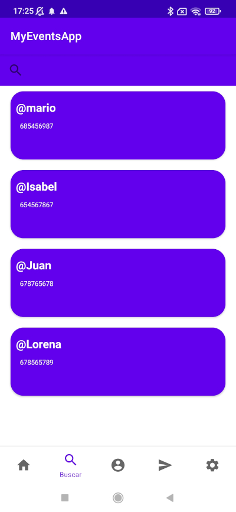
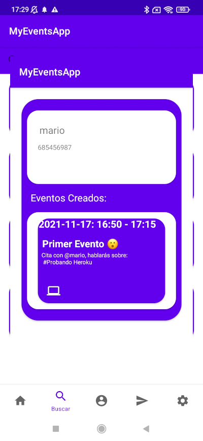
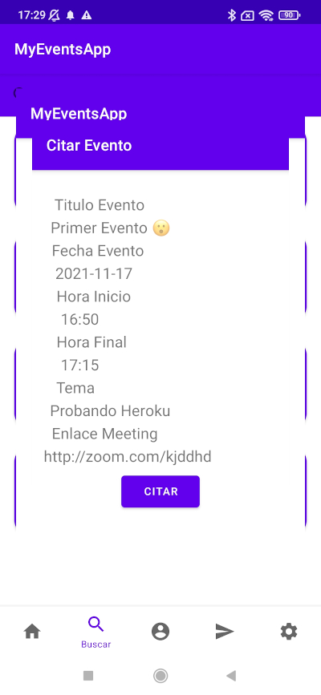
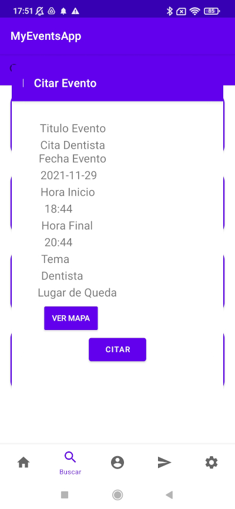
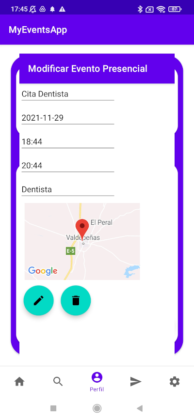

#### CICLO FORMATIVO DE GRADO SUPERIOR

### DESARROLLO DE APLICACIONES MULTIPLATAFORMA

##### ACCESO A DATOS - 2º CURSO

# AppEventos

###### Curso: 2021/22

###### AUTOR: Mario Parrilla Maroto

------

# Introducción

## Motivación y objetivos

He decidido realizar una aplicacion de eventos para dar solucion a las personas que quieres quedar o pedir cita para un evento o situacion, como por ejemplo realizar una reunión, quedar alguien para contratarle...

## Descripción de la aplicación

Esta aplicacion, permitirá al usuario solicitar eventos a otros usuarios, ademas de aceptar eventos que le pidan otros usuarios. Los eventos podran ser presencialmente dando la ubicación del lugar de quedada/evento, o remotamente atraves de un enlace de una plataforma de videoconferencia como zoom, google meets,... Además, los eventos tendras una duración determinada. El usuario al cual le estan citando, podrá cancelar eventos.

# Especificación de requisitos

## Requisitos funcionales

RQ1 - Control de Acceso: Se controlará mediante una ventana con un formulario de login donde los usuarios iniciarán sesión. (Para tener cuenta de usuario en la app, se tendrá que dar de alta desde el CMS). Además desde la ventana de ajustes, se podrá cerrar la sesion del usuario actual.

RQ2 - Gestión de Eventos: En las diferentes ventanas encontraremos las diferentes funcionalidades donde podremos hacer los eventos de CRUD, ademas de ver mapas segun el evento. Además, en esta app al trabajar con los eventos se modificará la base de datos local creada previamente por la app con los datos recibidos del CMS en la sincronización.

RQ2.1 - Ventana de Ajustes: En esta ventana, encontraremos diferentes funcionalidades como acerca de, soporte y cerrar sesion del usuario actual.

RQ2.2 - Ventana de Inicio: En esta ventana, encontraremos las cardview de los eventos del dia actual con datos de importacia, donde el usuario a citados a otros usuarios. Si pinchamos sobre la tarjeta de un evento de esta ventana, se nos abrirá un pop up (una nueva ventana), donde podremos ver los detalles al completo del evento.

RQ2.3 - Ventana de Busqueda: En esta ventana, encontraremos una barra de busqueda donde podremos filtrar las cardviews por los nombres de los usuarios de la app. Además, veremos las cardview de los usuarios con su username y su descripción. Cuando hagamos click sobre una cardview, se abrirá un pop up (una nueva ventana), donde podremos ver el perfil del usuario con su información y todos sus eventos creados. Si pinchamos sobre un evento del perfil de este usuario, se nos motrará un pop up (una nueva ventana), con la información detallada de ese evento con la opción de citar este evento.

RQ2.4 - Ventana de Perfil: En esta ventana, encontraremos la informacion de nuestro usuario, ademas de las cardviews de nuestros eventos ya creados con la información más impotante. Si pinchamos sobre estos eventos, podremos ver su información más detallada, ademas de poder modificar su información y poder eliminar el evento. También, podremos crear nuevos eventos atraves de un fab el cual contendrá otros dos fab, donde podremos o crear un evento presencial, donde se podrá crear el evento con su información precisa o el crear un evento meeting, donde se podrá crear el evento con su información precisa. Por último, si pinchamos en el telefono de usuario podremos llamarlo o mandar un sms.

RQ3 - Chat: Chat será bluetooth con el cual se podrá hablar con otros usuarios. A este requirimiento se podrá acceder desde una ventana de chat.

RQ4 - Sincronización: El CMS le enviará peticiones a la app para que sincronice los datos de la base de datos local de la app con la base de datos del CMS.

## Requisitos no funcionales

Seguridad: El usuario necesitará un usuario con su información para poder accerder a la aplicación.

Conectividad: El dispositivo movil, necesitará de conexión wifi, bluetooth y gps.

Tipos de dispositivos: Smartphones y tablets android en principio con versiones de android apartir de 5.0 .

Memoria: Los dispositivos necesitarán minimo 512MB de memoria RAM, aunque se recominenda 2Gb.

Procesador: Minimo se necesitará un procesador con Quad Core a 1.2GHz.

Almacenamiento: se necesitará minimo de un 1Gb de almacenamiento.

## Wireframe

LOGIN:
El usuario entrará con su usuario en la aplicación pudiendo guarda la sesión. Ádemas, podrá recordar la contraseña si no la recuerda.

REGISTRO:
El usuario se podrá registrar en la aplicación y crear su propio usuario.

RECORDAR CONTRASEÑA:
Aquí el usuario podrá recordar su contraseña recibiendo un correo a su email con un codigo concreto.

NUEVA CONTRASEÑA: 
Aquí el usuario podrá crear una nueva contraseña para su cuenta.

INICIO:
Este es el menu inicial donde podrá encontrar los eventos que tiene ese dia, de lo contrario, podrá ir a buscar eventos.

BUSQUEDA:
Aquí el usuario buscará a los usuarios a los cuales desea citar un evento.

NOTIFICACIONES:
Aqui se mostrarán las notificaciones de la aplicación.

PERFIL PERSONAL:
Aquí el usuario verá sus eventos puediendo modificarlos a su elección.

PERFIL AJENO:
Aquí el usuario podrá elegir el dia y la hora disponible para citar un evento a otro usuario.

AJUSTES:
Aquí encontrará la selección del idioma de la aplicación, ademas de otros datos de interés.

EVENTO:
Aquí el usuario citador podrá ver la información de un evento puediendo cancelar su cita.

CITAR EVENTO:
El usuario podrá seleccionar los datos de la cita.

MODIFICAR EVENTO:
El usuario podrá editar sus eventos e incluso cancelarlos.

# Análisis Funcional

## Interfaz gráfico

App:

Login:

Inicio: Aquí podemos ver como se ven las cardviews meeting, presencial y cuando no se tengan eventos disponibles.

Info Evento Meeting: 

Info Evento Presencial:

Ajustes:

Chats:

Buscar:

Perfil Externo:

Citar Evento Meeting:

Citar Evento Presencial:

Perfil Personal:

Perfil Personal Opciones: 

Crear Evento Meeting:

Crear Evento Presencial:

Modificar/Borrar Evento Meeting:

Modificar/Borrar Evento Presencial:

## Diagrama de clases

Se debe incluir un diagrama de clases y la descripción de las mismas.

## Diagrama E/R

### TABLA -- USUARIO

Todos los datos de esta tabla son Not Null, no pueden ser nulos

userID: Es la clave principal de la tabla, que será el identificador del usuario, que es de tipo bigint.

username: Es el nombre de usuario, que es de tipo varchar.

email: Es el correo electronico del usuario, que es de tipo varchar.

password: Es la contraseña del usuario, que es de tipo varchar.

phonenumber: Es el numero de telefono del usuario, que es de tipo varchar.

enabled: Nos servirá para saber si el usuario puede utilizarse o no, que es de tipo bit que en verdad es un boolean.

### TABLA -- EVENTO

eventID: Es la clave principal de la tabla, que será el identificador del evento, que es de tipo bigint. NotNull.

username: Es el nombre de evento, que es de tipo varchar. NotNull.

start_time: Es la fecha y hora del inicio del evento, que es de tipo Datetime. NotNull.

end_time: Es la fecha y hora de final del evento, que es de tipo Datetime. NotNull.

event_preference: Con este dato, segun su valor, si es 0 será un evento presencial y si no, será un evento meeting y con esto trabajaremos con diferentes datos según este valor, es de tipo bit, que en realidad es un boolean. NotNull.

coordinates: Son las coordenadas de la localizacion del lugar de quedada del evento, es de tipo varchar.

videomeeting: Es el enlace de la videoconferencia del evento, es de tipo varchar.

available: Con este dato sabremos si el evento esta activado o no según su valor (0 = desahabilitado / 1 = habilitado), es de tipo bit, pero en realidad es de tipo boolean. NotNull.

user_owner_id_user: es la id del usuario que ha creado el evento, es de tipo bigint. NotNull.

user_summoner_id_user: es la id del usuario que ha citado al creador el evento, es de tipo bigint.

## Plan de pruebas

Define los casos de prueba que se deben realizar para comprobar el correcto funcionamiento de la aplicación móvil.

# Diseño Técnico

## Diagrama de paquetes y de componentes

Se debe incluir un diagrama de paquetes, de componentes, etc.

También se puede incluir la estructura y descripción de los ficheros que forman parte del proyecto. Descripción 

de algoritmos, etc.

## Arquitectura del sistema

Describir la arquitectura del sistema (diagrama de despliegue).

## Entorno de desarrollo, librerías y servicios

En este punto se explicarán las diferentes tecnologías utilizadas para la realización del proyecto, así como los elementos más importantes que permitan entender el funcionamiento del sistema.

## Instrucciones para la compilación, ejecución y despliegue de la aplicación

Describe los pasos a seguir para poder compilar el proyecto y ejecutarlo.

## Informe de pruebas

### Pruebas en emuladores y dispositivos reales

Incluye pantallazos de la ejecución de los casos de prueba realizadas en los emuladores y dispositivos reales.

### Pruebas remotas

Incluye pantallazos de la ejecución de los casos de prueba realizadas en dispositivos reales remotos.

# Conclusiones

## Conocimientos adquiridos

Reflexiona sobre el trabajo realizado durante el desarrollo de la aplicación móvil y sobre los conocimientos adquiridos, problemas encontrados, etc.

## Mejoras futuras

Incluye aspectos y nueva funcionalidad que incluirías en la aplicación en un futuro próximo. 
